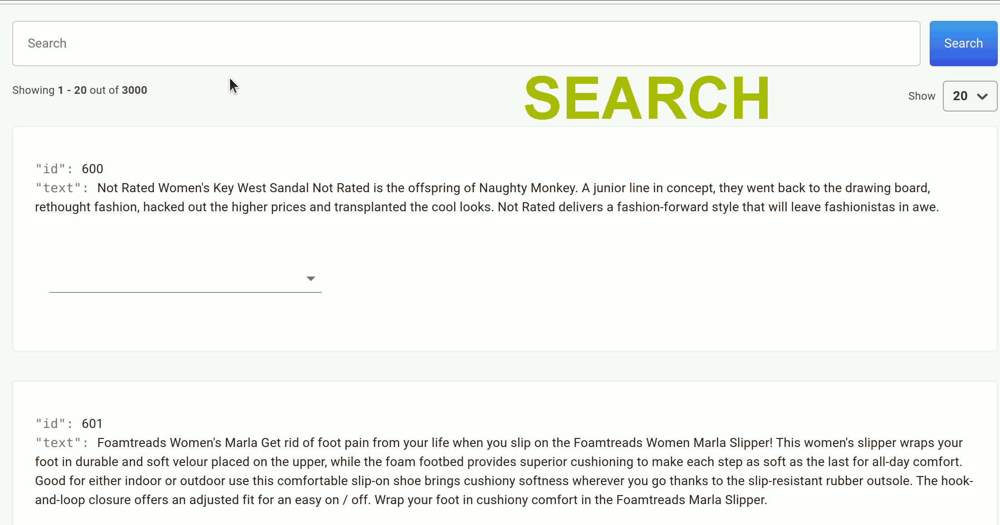

    
    <h1 align="center">DataQA</h1>

    
    
    
    

&nbsp;

DataQA is a tool to label and explore unstructured documents. It is the only tool that uses rules-based weak supervision to significantly reduce the number of labels needed compared to other tools. Here are a few things you can do with it:
- Search your documents using Elasticsearch powerful text search engine,
- Classify your documents,
- Extract entities from your own data or from Wikipedia,
- Link mentions of entities to your own ontology.

... and it's all available with a simple pip command!

    

* [Installation](#installation)
* [Usage](#usage)
* [What is weak supervision and why does it work?](#what-is-weak-supervision-and-why-does-it-work-?)
* [Tutorials](#documentation)
* [Contact](#contact)

# Installation

## Pre-requisites:

* Python 3.6, 3.7, 3.8 and 3.9
* (Recommended) start a new python virtual environment
* Update your pip `pip install -U pip`
* Tested on backend: MacOSX, Ubuntu. Tested on browser: Chrome.

## Installing from pypi

To install the package from pypi:

### Python versions 3.6, 3.7, 3.8

* `pip install dataqa`

### Python version 3.9

* `pip install dataqa --use-deprecated=legacy-resolver`

* This is due to an error in snorkel's dependencies, which uses a low version of the `networkx` package incompatible with python 3.9 ([issue in github](https://github.com/snorkel-team/snorkel/issues/1667)). The latest dependency resolver shipped with pip throws an error when a package has incompatible requirements (read more [here](https://pip.pypa.io/en/latest/user_guide/#changes-to-the-pip-dependency-resolver-in-20-3-2020)).

## To run with Docker

* `docker build . -t dataqa`
* `docker run -p 5000:5000 dataqa`

# Usage

In the terminal, type `dataqa run`. Wait a few minutes initially, as it takes some minutes to start everything up.

Doing this will run a server locally and open a browser window at port `5000`. If the application does not open the browser automatically, open `localhost:5000` in your browser. You need to keep the terminal open.

To quit the application, simply do `Ctr-C` in the terminal. To resume the application, type `dataqa run`. Doing so will create a folder at `$HOME/.dataqa_data`.

## Uploading data

The text file needs to be a csv file in utf-8 encoding of up to 30MB with a column named "text" which contains the main text. The other columns will be ignored.

This step is running some analysis on your text and might take up to 5 minutes.

## Uninstall

In the terminal:

* `dataqa uninstall`: this deletes your local application data in the home directory in the folder `.dataqa_data`. It will prompt the user before deleting.
* `pip uninstall dataqa` 

### Does this tool need an internet connection?

Nope. **No data will ever leave your local machine.**

## Troubleshooting

If the project data does not load, try to go to the homepage and `http://localhost:5000` and navigate to the project from there.

Try running `dataqa test` to get more information about the error, and bug reports are very welcome!

To test the application, it is possible to upload a text that contains a column "\_\_LABEL\_\_". The ground-truth labels will then be displayed during labelling and the real performance will be shown in the performance table between brackets.

# Documentation

Documentation at: [https://dataqa.ai/docs/](https://dataqa.ai/docs/).

* To get started with a multi-class classification problem, go [here](https://dataqa.ai/docs/tutorials/ecomm_product_categories/classification_product_categories/).
* To get started with a named entity recognition problem, go [here](https://dataqa.ai/docs/tutorials/medical_side_effects/ner_medical/).

# What is weak supervision and why does it work?

Weak supervision is a set of techniques to produce noisy labels for large quantities of data. It has gained popularity in recent years due to the large amounts of data typically needed for ML systems. It includes a set of powerful techniques to encode any prior domain knowledge that the annotator has in the form of rules. Even though these rules can be noisy, the algorithm learns how to weigh them accordingly and use them as signals when labelling the data.

# Contact

For any feedback, please contact us at contact@dataqa.ai. Also follow me on [![alt text][1.1]][1] for more updates and content around ML and labelling.

[1.1]: https://i.imgur.com/wWzX9uB.png 
[1]: https://www.twitter.com/DataqaAi
